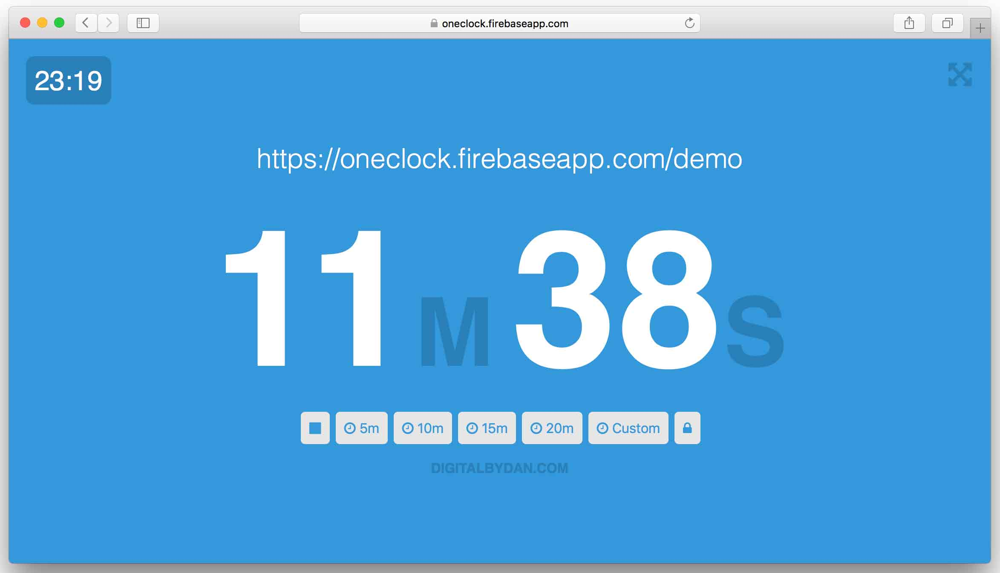

# OneClock
Create countdown timers that are synchronised in real-time across unique sharable URLs. Built originally for use at a conference for sharing speaker timings across the compère and AV staff.



## How it works
The project has been built in React making use of Firebase to provide the real-time synchronous functionality.

## Configuration
Create a [firebase app](https://firebase.google.com) and set the database rules to public for read/write. You should then add your database credentials to an .env file in the root of the project. These credentials can be found from clicking 'add firebase to your web app' from the overview board of your newly created Firebase app.

OneClock makes use of the dotenv environment loading that comes preconfigured from react-create-app. As such the environment variables need to be prefixed with 'REACT_APP' and thus the environment file will look like the following.
``` text
REACT_APP_FB_API_KEY=
REACT_APP_FB_DATABASE_URL=
```

## Commands
``` bash
# install dependencies
npm install

# start webpack in development mode
npm run start

# build for production
npm run build
```
